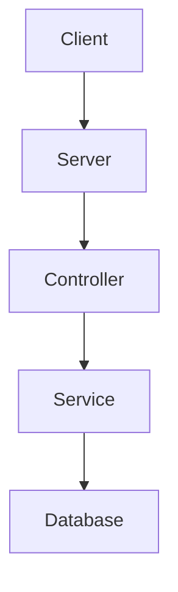

# Sample Node.js Application

This document provides an overview of a sample Node.js application. It includes a mermaid diagram to illustrate the application's architecture and reference links for further reading.

## Application Architecture



## Getting Started

To get started with the sample Node.js application, follow these steps:

1. Clone the repository:
    ```sh
    git clone https://github.com/your-repo/sample-nodejs-app.git
    ```
2. Install dependencies:
    ```sh
    cd sample-nodejs-app
    npm install
    ```
3. Start the application:
    ```sh
    npm start
    ```

## Reference Links

- [Node.js Official Website](https://nodejs.org/)
- [Express.js Documentation](https://expressjs.com/)
- [MongoDB Documentation](https://docs.mongodb.com/)

## License

This project is licensed under the MIT License. See the [LICENSE](LICENSE) file for details.